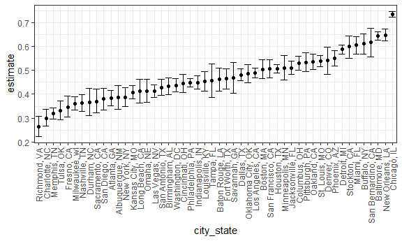
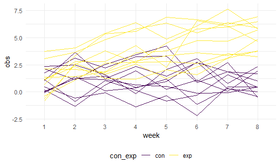

p8105\_hw5\_xy2517
================
Xuehan Yang
2021/11/15

``` r
library(tidyverse)

knitr::opts_chunk$set(
  fig.width = 6,
  fig.asp = .6,
  out.width = "90%"
)

theme_set(theme_minimal() + theme(legend.position = "bottom"))

options(
  ggplot2.continuous.colour = "viridis",
  ggplot2.continuous.fill = "viridis"
)

scale_colour_discrete = scale_colour_viridis_d
scale_fill_discrete = scale_fill_viridis_d
```

## Problem 1

**Load the data of homicides in 50 large U.S. cities.**

``` r
homicides_df = read_csv(file = "./data/homicide-data.csv", na = c("", "Unknown"))
```

The raw data contained 52179 homicides and the location of the killing,
whether an arrest was made and, in most cases, basic demographic
information about each victim. Specifically, there are 12 variables,
including uid, reported\_date, victim\_last, victim\_first,
victim\_race, victim\_age, victim\_sex, city, state, lat, lon,
disposition.

**Obtain the total number of homicides and the number of unsolved
homicides by cities.**

``` r
homicides_df =
  homicides_df %>% 
  mutate(
    city_state = str_c(city,", ",state),
    unsolved = case_when(disposition %in% c("Closed without arrest","Open/No arrest") ~ 1, TRUE ~ 0))

homicides_city =
  homicides_df %>% 
  group_by(city_state) %>% 
  summarise(
    num_homicide = n(),
    num_unsolved = sum(unsolved)
  )

head(homicides_city) %>% knitr::kable()
```

| city\_state     | num\_homicide | num\_unsolved |
|:----------------|--------------:|--------------:|
| Albuquerque, NM |           378 |           146 |
| Atlanta, GA     |           973 |           373 |
| Baltimore, MD   |          2827 |          1825 |
| Baton Rouge, LA |           424 |           196 |
| Birmingham, AL  |           800 |           347 |
| Boston, MA      |           614 |           310 |

**Baltimore estimation**

``` r
baltimore_df =
  homicides_city %>% 
  filter(city_state == "Baltimore, MD")

test_result = prop.test(x = pull(baltimore_df, num_unsolved), n = pull(baltimore_df, num_homicide))
```

p\_value is 0.6455607

confidence interval is (0.6275625, 0.6631599)

**Iteration through whole cities**

``` r
p_estimate_city =
  homicides_city %>% 
  mutate(
    test = map2(.x = num_unsolved, .y = num_homicide, ~prop.test(x = .x, n = .y)),
    tidy = map(test, broom::tidy)) %>% 
  unnest(tidy) %>% 
  select(city_state, estimate, starts_with("conf"))

head(p_estimate_city) %>% knitr::kable()
```

| city\_state     |  estimate |  conf.low | conf.high |
|:----------------|----------:|----------:|----------:|
| Albuquerque, NM | 0.3862434 | 0.3372604 | 0.4375766 |
| Atlanta, GA     | 0.3833505 | 0.3528119 | 0.4148219 |
| Baltimore, MD   | 0.6455607 | 0.6275625 | 0.6631599 |
| Baton Rouge, LA | 0.4622642 | 0.4141987 | 0.5110240 |
| Birmingham, AL  | 0.4337500 | 0.3991889 | 0.4689557 |
| Boston, MA      | 0.5048860 | 0.4646219 | 0.5450881 |

**Create a plot that shows the estimates and CIs for each city**

``` r
p_estimate_city %>% 
  filter(city_state != "Tulsa, AL") %>% 
  mutate(city_state = fct_reorder(city_state, estimate)) %>% 
  ggplot(aes(x = city_state, y = estimate)) +
  geom_point() +
  geom_errorbar(aes(ymin = conf.low, ymax = conf.high)) +
  theme_bw() +
  theme(axis.text.x = element_text(angle = 90, vjust = 0.5, hjust = 1))
```



As we can see from the plot, the estimate proportion of unsolved crime
is different in different cities and Chicago has the highest estimate
proportion.

## Problem 2

**Create a tidy dataframe containing data from all participants**

Start with a dataframe containing all file names

``` r
participants_df = list.files("./data/hw5_data/") %>% as_tibble() %>% rename(file_name = value)
```

Iterate over file names and read in data for each subject

``` r
participants_df = 
  participants_df %>% mutate(
    result = map(.x = file_name, ~read_csv(str_c("./data/hw5_data/", .x)))
  ) %>% 
  mutate(file_name = str_replace(file_name, ".csv", "")) %>% # tidy the result
  separate(file_name, into = c("con_exp", "id"), sep = "_") %>% 
  unnest(result) %>% 
  pivot_longer(
    week_1:week_8,
    names_to = "week",
    values_to = "obs",
    names_prefix = "week_"
  )
```

**Make a spaghetti plot showing observations on each subject over time,
and comment on differences between groups.**

``` r
participants_df %>% 
  arrange(week) %>% 
  ggplot(aes(x = week, y = obs, group = interaction(id, con_exp), color = con_exp)) +
  geom_line()
```



In the first week, this is no obvious difference between control group
and experiment group on observations. As the study progress, there is a
growing difference between control group and experiment group on
observations. And the rising observation of experiment group led to this
situation.

## Problem 3
